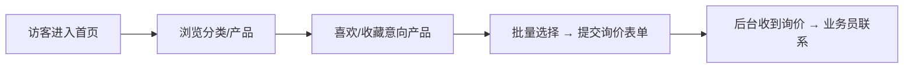
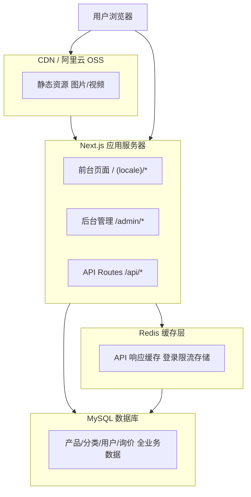

# 前台官网开发需求文档

**版本**: v3.0

**日期**: 2026-06-12

**项目**: 电玩设备制造商官网

**技术栈**: Next.js 14 + App Router

## 1\. 文档概述

### 1.1 术语表

| 术语 | 定义 | |------|------| | \`likeBase\` | 产品初始喜欢基数，产品入库时随机生成 50\~1000，生成后固定不变 | | \`actualLikeCount\` | 实际用户点赞数，由后台统一维护，动态更新 | | \`likeCount\` | 前端显示的总喜欢数，计算公式：`likeCount = likeBase + actualLikeCount` | | \`actualLikeCount\` | 存储在 product 表，用户点赞/取消时异步更新 | | \*\*Next.js 统一全栈\*\* | 前台官网与后台管理系统共用一个 Next.js 14 项目，同一代码库、同一数据库 |

### 1.2 更新记录

| 版本 | 日期 | 更新内容 | |------|------|----------| | v2.0 | 2026-05-27 | 初始版本，需求范围定义 | | v3.0 | 2026-06-12 | 统一技术栈为 Next.js 全栈；补全安全策略；统一 likeCount 计算逻辑；移除价格筛选；增加验证码 |

### 1.3 文档适用范围

本文档描述**前台官网**的完整开发需求，包括：页面结构、组件设计、API 调用、交互细节、性能要求、安全策略。后台管理系统需求请参考《后台管理系统开发需求文档 v1.0》。

## 2\. 产品目标与背景

### 2.1 业务背景

我们是电玩设备源头工厂制造商，核心产品包括拳击机、娃娃机、赛车机、VR 设备、娱乐设备等。官网同时面向 B2B（游乐场馆、商场、娱乐中心采购）和 B2C（个人玩家）客户。

### 2.2 核心目标

| 目标 | 说明 | |------|------| | 品牌传达 | 清晰传达"源头工厂制造商"定位，建立专业信任 | | 产品展示 | 全系列产品分类展示，突出产品卖点与规格 | | 询价转化 | 通过表单+喜欢列表引导客户提交询价 | | SEO 流量 | 获取精准搜索流量，提升自然排名 | | 多语言 | 全站文字内容支持一键语言切换 |

### 2.3 约束条件

  - **无交易系统**：不需要购物车、支付、订单等交易功能
  - **全 API 驱动**：所有页面数据均从后端 API 获取，前端不硬编码任何业务数据
  - **纯展示 + 询价**：核心转化路径为"浏览 → 喜欢 → 询价表单提交"
  - **技术统一**：前台与后台管理系统共享同一 Next.js 14 项目，同一数据库，同一 Redis 缓存。后台管理在同一项目的 `/admin/*` 路由下
  - **每次请求都要考虑加载速度和对数据库的压力**

## 3\. 用户与使用场景

### 3.1 B2B 采购客户

**画像**：游乐场/商场经营者、采购经理，专业人士，目的性强，关注产品品质、价格、供应能力。

**核心行为**：浏览分类 → 筛选产品 → 批量收藏 → 提交询价 → 等待工厂联系。

**需求关注点**：规格参数清晰、起订量、交货周期、售后服务。

### 3.2 B2C 个人玩家

**画像**：个人购买家用设备，关注产品外观、娱乐性、价格。

**核心行为**：浏览热门产品 → 收藏喜欢的产品 → 询价联系。

**需求关注点**：安装指导、保修服务、配送方式。

### 3.3 核心用户旅程

核心用户转化路径

## 4\. 技术架构

### 4.1 技术栈

| 体系    | 技术                    | 版本               | 使用理由               |
| ----- | --------------------- | ---------------- | ------------------ |
| 全栈框架  | Next.js               | 14+ (App Router) | SSR/SSG 支持，SEO 优秀  |
| 语言    | TypeScript            | 5.x              | 类型安全，减少 bug        |
| UI 框架 | Tailwind CSS          | 3.4              | 原子化 CSS，快速开发       |
| 组件库   | shadcn/ui             | 最新               | 基于 Radix UI，高质量可定制 |
| 图标    | Lucide React          | 最新               | 轻量高质量图标            |
| 动画    | Framer Motion         | 最新               | React 动画库，流畅交互     |
| 表单    | React Hook Form + Zod | 最新               | 表单管理+验证            |
| 多语言   | next-intl             | 最新               | 国际化 SSR 友好         |
| ORM   | Prisma                | 5.x              | 类型安全，防 SQL 注入      |
| 数据库   | MySQL                 | 8.0+             | 成熟稳定，支持高并发         |
| 缓存    | Redis                 | 最新               | API 缓存、限流存储        |
| 文件处理  | ali-oss               | 最新               | 阿里云 OSS SDK        |
| 认证    | NextAuth              | 5.x              | 后台管理登录认证           |
| 验证码   | Cloudflare Turnstile  | \-               | 免费、无隐私问题、防机器人提交    |

### 4.2 前后台数据交互架构

系统架构图

### 4.3 渲染策略

| 页面 | 渲染策略 | 说明 | |------|----------|------| | 首页 | SSR (force-dynamic) | 聚合数据实时更新 | | 产品列表 | SSR | 支持筛选搜索，需实时数据 | | 产品详情 | ISR | 内容不常变化，可增量静态再生成 | | 联系我们 | SSR | 表单需实时数据，地图动态加载 | | 场地设计 | ISR | 内容不常变化，revalidate 1h | | 关于我们 | SSG | 静态内容，构建时生成 | | 文章内容 | SSR | 文章列表分页需实时查询 | | 文章详情 | ISR | 文章内容不常变化 |

## 3\. 设计规范与 UI 风格

### 3.1 视觉风格定义

**风格关键词**：拟物化 + 科技感 + 专业感 + 高端质感 + 霓虹发光

以深色底色为主，配合霓虹渐变发光边框和拟物化质感，营造电玩行业特有的科技感与娱乐感。核心交互元素（搜索框、产品卡片、导航菜单）采用动态发光追踪效果，鼠标移动时边框光晕跟随指针流转，增强沉浸感。

### 3.2 色彩系统

#### 主色板

| 角色      | 色值        | 用途                  |
| ------- | --------- | ------------------- |
| 主色-霓虹紫  | `#8B5CF6` | 品牌主色、CTA 按钮、Logo 强调 |
| 主色-赛博蓝  | `#3B82F6` | 链接色、辅助按钮、信息强调       |
| 强调色-霓虹绿 | `#22C55E` | 成功状态、在线标识           |
| 强调色-金橙  | `#F59E0B` | 价格标签、热门标识           |
| 强调色-火焰红 | `#EF4444` | 促销标签、CTA 辅助色        |
| 发光紫     | `#402FB5` | 搜索框/卡片边框发光色         |
| 发光粉     | `#CF30AA` | 搜索框/卡片边框发光色         |

#### 背景色板

| 角色     | 色值        | 用途         |
| ------ | --------- | ---------- |
| 深色主背景  | `#0F172A` | 页面主背景      |
| 深色次级背景 | `#1E293B` | 卡片背景、区块背景  |
| 深色强调背景 | `#334155` | 悬浮面板、弹窗背景  |
| 浅色主背景  | `#FFFFFF` | 部分页面浅色区域背景 |
| 浅色次级背景 | `#F8FAFC` | 浅色区域卡片背景   |

#### 文字色板

| 角色   | 深色模式      | 浅色模式      |
| ---- | --------- | --------- |
| 主文字  | `#F1F5F9` | `#0F172A` |
| 次要文字 | `#94A3B8` | `#475569` |
| 辅助文字 | `#64748B` | `#94A3B8` |

### 3.3 导航栏双主题

| 主题 | 背景 | 文字 | 触发场景 | |------|------|------|---------| | 暗色系 | `rgba(15,23,42,0.85)` + `backdrop-blur-xl` | `#F1F5F9` | 首页 Hero 区域、深色页面 | | 白色系 | `rgba(255,255,255,0.9)` + `backdrop-blur-xl` | `#0F172A` | 浅色页面区域 |

切换逻辑：导航栏监听下方当前可视区域的背景色调动态切换，`transition: all 0.4s ease` 过渡。

**导航栏菜单交互参考**：采用 Framer Motion 实现类似 glow-menu 的发光交互效果——鼠标悬浮时菜单项出现 3D 翻转 + 径向渐变发光背景 + 整体导航栏悬浮发光效果。

### 3.4 字体系统

| 用途 | 字号 (Desktop)    | 字号 (Mobile) | 字重           |
| -- | --------------- | ----------- | ------------ |
| H1 | 48px / 3rem     | 28px        | Bold 700     |
| H2 | 36px / 2.25rem  | 24px        | Bold 700     |
| H3 | 24px / 1.5rem   | 20px        | Semibold 600 |
| H4 | 20px / 1.25rem  | 18px        | Semibold 600 |
| 正文 | 16px / 1rem     | 14px        | Regular 400  |
| 辅助 | 14px / 0.875rem | 12px        | Regular 400  |

字体栈：`Inter, "PingFang SC", "Microsoft YaHei", system-ui, sans-serif`

### 3.5 间距/圆角/阴影系统

**间距**：4px 网格，Token 从 xs(4px) → 3xl(64px)

**圆角**：sm(6px) / md(10px) / lg(16px) / xl(24px) / full(9999px)

**阴影**：

| 层级          | 值                                  | 用途     |
| ----------- | ---------------------------------- | ------ |
| md          | `0 4px 6px -1px rgba(0,0,0,0.1)`   | 卡片默认   |
| lg          | `0 10px 15px -3px rgba(0,0,0,0.1)` | 卡片悬浮   |
| glow-purple | `0 0 30px rgba(139,92,246,0.4)`    | 霓虹发光效果 |
| glow-blue   | `0 0 30px rgba(59,130,246,0.4)`    | 霓虹发光效果 |

4\. 全局组件设计

### 4.1 组件目录结构

    src/components/
    ├── ui/                        # shadcn/ui 基础组件 + 复刻组件
    │   ├── expanding-cards.tsx    # 伸缩卡片（参考复刻1）
    │   ├── tree.tsx               # 树形组件（参考复刻2）
    │   ├── alert-*.tsx            # 提示弹窗组件（参考复刻3）
    │   ├── spotlight-card.tsx     # 发光产品卡片（参考 GlowCard）
    │   ├── glow-search.tsx        # 发光搜索框
    │   ├── switch.tsx             # shadcn Switch
    │   └── label.tsx              # shadcn Label
    ├── layout/
    │   ├── Navbar.tsx             # 导航栏（双主题 + 3D翻转 glow-menu 交互 + 多级下拉）
    │   ├── Footer.tsx             # 页脚
    │   └── FloatingActions.tsx    # 右侧悬浮按钮组（喜欢+询价）
    ├── product/
    │   ├── ProductCard.tsx        # 产品卡片（基于 SpotlightCard）
    │   ├── ProductGrid.tsx        # 产品网格
    │   ├── ProductFilter.tsx      # 产品筛选器
    │   └── CategoryNav.tsx        # 分类导航（多级 Megamenu + 预览图）
    ├── favorites/
    │   ├── FavoritePanel.tsx      # 喜欢列表面板（右侧滑出）
    │   └── FavoriteDrawer.tsx     # 喜欢列表抽屉（移动端）
    ├── inquiry/
    │   └── InquiryForm.tsx        # 询价表单
    ├── common/
    │   ├── SkeletonCard.tsx       # 骨架屏卡片
    │   ├── Pagination.tsx         # 分页器
    │   ├── LanguageSwitch.tsx     # 语言切换器
    │   ├── ImageViewer.tsx        # 图片查看器（点击放大）
    │   ├── AnimatedSection.tsx    # 滚动入场动画容器
    │   ├── ErrorBoundary.tsx     # 错误边界组件
    │   └── NetworkError.tsx      # 网络断开提示组件
    └── sections/
        ├── HeroBanner.tsx         # 首页 Hero（视频背景）
        ├── HotCategories.tsx      # 热门分类
        ├── HotProducts.tsx        # 热门产品
        ├── WhyChooseUs.tsx        # 为什么选择我们
        ├── CustomerReviews.tsx    # 客户评论
        ├── ServedClients.tsx      # 我们服务过的客户
        ├── VenueShowcase.tsx      # 场地设计展示
        ├── SuitableVenues.tsx     # 产品适合场所
        ├── PurchaseProcess.tsx    # 采购流程
        └── ContactForm.tsx        # 联系表单

### 4.2 右侧悬浮按钮组（FloatingActions）

**位置**：页面右侧固定悬浮，独立于导航栏

    页面右侧：
              ┌──────┐
              │  ♥ 3 │  ← 喜欢按钮（显示数量角标）
              └──────┘
              ┌──────┐
              │  ✉   │  ← 询价按钮
              └──────┘
              ┌──────┐
              │  ↑   │  ← 返回顶部（滚动>300px显示）
              └──────┘

**样式**：

  - 竖直排列，距页面右边缘 24px，距底部 30%
  - 每个按钮 48×48px，圆形，深色半透明背景 + 霓虹紫边框发光
  - 悬浮时发光加强 + 微上移
  - 喜欢按钮角标显示当前喜欢数量

**交互**：

  - 点击喜欢按钮 → 右侧滑出 FavoritePanel
  - 点击询价按钮 → 平滑滚动至页面底部 ContactForm 区块
  - 点击返回顶部 → 平滑滚动到顶部
  - 移动端：按钮组缩小为 40×40px，距右边缘 16px

### 4.3 产品卡片组件（ProductCard）

**基于 SpotlightCard（GlowCard）实现**，鼠标移动时卡片边框产生追踪发光效果。

**数据字段**：

    interface Product {
      id: string
      name: string
      coverImage: string
      price: number | null
      summary: string
      category: { id: string; name: string }
      subCategory: { id: string; name: string }
      likeCount: number           // 喜欢人数 = likeBase + actualLikeCount（后端计算）
      isFavorite: boolean
    }

**交互**：

  - 鼠标在卡片上移动：SpotlightCard 边框发光跟随鼠标位置
  - 鼠标移入：喜欢按钮渐显（右上角）+ 显示喜欢人数
  - 点击卡片 → 跳转产品详情页
  - 点击喜欢按钮 → 切换喜欢状态（心形填充动画）→ 同步全局喜欢列表 → likeCount +1/-1（前端乐观更新）
  - 鼠标移出：恢复原样

**喜欢人数（likeCount）计算**：

    likeCount = 数据库中存储的 likeBase（后端初始化时随机生成 50~1000）
              + 后端维护的 actualLikeCount（实际用户点赞数）
    
    后端逻辑：
    - 产品入库时，likeBase = Math.floor(Math.random() * 951) + 50  （50~1000）
    - 每次 API 返回产品数据时，likeCount = likeBase + actualLikeCount
    - 用户点赞/取消点赞时，actualLikeCount 异步更新到 product 表

### 4.4 喜欢列表面板（FavoritePanel）

**触发**：点击右侧悬浮喜欢按钮

    ┌─ 我喜欢的 ──────────────────┐
    │ ☑ 全选                      │
    │                              │
    │ ☑ [图片] 产品A  ¥xxx  238人 │
    │ ☑ [图片] 产品B  ¥xxx  156人 │
    │ ☐ [图片] 产品C  ¥xxx  412人 │
    │                              │
    │ 已选 2 件                   │
    │ [立即咨询]                   │
    └──────────────────────────────┘

**功能**：

  - 显示所有喜欢的产品（图片+标题+价格+喜欢人数）
  - 每项带选择框，支持全选/单选
  - "立即咨询"→ 滚动到询价表单，自动填入选中产品
  - 点击单项可移除喜欢

### 4.5 询价表单组件（InquiryForm）

| 字段     | 类型       | 必填 | 说明                       |
| ------ | -------- | -- | ------------------------ |
| 姓名     | text     | 是  |                          |
| 电话     | tel      | 是  | 格式校验（Zod）                |
| 邮箱     | email    | 是  | 格式校验（Zod）                |
| 预算     | select   | 否  | 选项从 API 获取               |
| 采购时间   | select   | 否  | 选项从 API 获取               |
| 收货地址   | text     | 否  |                          |
| 感兴趣的产品 | readonly | 否  | 从喜欢列表自动填入；若为空显示"去添加产品"链接 |

**验证码**：提交前需要通过 Cloudflare Turnstile 人机验证。

### 4.6 分类导航组件（CategoryNav）— 多级下拉菜单 + 预览图

**多级 Megamenu 布局**：最多支持三级分类（一级→二级→三级），最后一级显示预览大图。

    ┌──────────────────────────────────────────────────────────────────────┐
    │  ┌─一级分类──┐  ┌─二级子类──────────────────────────────┐  ┌─三级+预览──┐ │
    │  │ 拳击机 ▶  │  │ 迷你拳击机 ▶                         │  │ [大预览图] │ │
    │  │ 娃娃机    │  │ 大型拳击机 ▶                         │  │  产品示例   │ │
    │  │ 赛车机 ▶  │  │ 专业拳击机                           │  │  图 500px  │ │
    │  │  VR设备    │  │ 儿童拳击机 ▶                         │  │            │ │
    │  │ 娱乐设备   │  │                                      │  │  点击跳转   │ │
    │  │ 游戏机 ▶  │  │                                      │  │  至该分类   │ │
    │  └──────────┘  └──────────────────────────────────────┘  └────────────┘ │
    │                                                                        │
    │  ┌─推荐产品────────────────────────────────────────────────────────────┐ │
    │  │ [产品1]  [产品2]  [产品3]  [产品4]  [产品5]  [产品6]               │ │
    │  └────────────────────────────────────────────────────────────────────┘ │
    └──────────────────────────────────────────────────────────────────────┘

**关键交互规则**：

  - 鼠标移入一级分类 → 展开对应的二三级子菜单
  - 鼠标移入二级分类 → 展开三级分类（如果存在）
  - 鼠标移入最后一级分类 → 右侧显示该分类的预览大图（从后台管理上传的 `previewImage` 字段读取）
  - 推荐产品行：显示该一级分类下的热门产品（最多 6 个）
  - 右侧预览图尺寸：最小 500×350px，图片采用 WebP 格式 OSS + CDN
  - 导航栏菜单 JavaScript 交互逻辑使用 `onMouseEnter`/`onMouseLeave` 控制展开收起，300ms 延迟隐藏防止闪烁
  - 移动端：完整分类采用 Accordion 手风琴展开/收起

**后台管理的数据要求**：

后台添加/编辑分类时需要上传：

| 字段               | 类型       | 说明              | 前台使用场景         |
| ---------------- | -------- | --------------- | -------------- |
| 图标 icon          | URL (上传) | 分类图标            | 导航栏菜单、分类选择器    |
| 预览图 previewImage | URL (上传) | 产品示例图（**必须上传**） | 导航栏最后一级右侧大预览图  |
| 分类图片 image       | URL (上传) | 分类封面图           | 产品列表分类侧边栏、分类卡片 |

### 4.7 导航菜单 3D 翻转交互（glow-menu 风格）

**参考用户提供的代码**：基于 Framer Motion 实现导航菜单项的 3D 翻转发光效果，使用树形结构（参考复刻2 Tree 组件的 `motion` 动画）实现多级菜单展开收起。

#### 导航栏菜单交互动画

    // Framer Motion variants
    const navItemVariants = {
      initial: { rotateX: 0, opacity: 1, y: 0 },
      hover: { 
        rotateX: -90, 
        opacity: 0, 
        y: -10,
        transition: { duration: 0.3, ease: [0.4, 0, 0.2, 1] }
      }
    };
    const backVariants = {
      initial: { rotateX: 90, opacity: 0, y: 10 },
      hover: { 
        rotateX: 0, 
        opacity: 1, 
        y: 0,
        transition: { duration: 0.3, ease: [0.4, 0, 0.2, 1] }
      }
    };
    
    // 整个导航栏悬浮发光效果
    const navbarGlow = {
      rest: { boxShadow: '0 0 0px rgba(139, 92, 246, 0)' },
      hover: { 
        boxShadow: '0 0 60px rgba(139, 92, 246, 0.25), 0 0 120px rgba(59, 130, 246, 0.15)',
        transition: { duration: 0.8, ease: 'easeOut' }
      }
    };

#### 下拉菜单展开/收起动画

    // 使用 AnimatePresence + motion 实现
    const dropdownVariants = {
      initial: { 
        opacity: 0, 
        y: -10, 
        scaleY: 0.95,
        transformOrigin: 'top' 
      },
      animate: { 
        opacity: 1, 
        y: 0, 
        scaleY: 1,
        transition: { duration: 0.25, ease: [0.4, 0, 0.2, 1] }
      },
      exit: { 
        opacity: 0, 
        y: -10, 
        scaleY: 0.95,
        transition: { duration: 0.15, ease: 'easeIn' }
      }
    };

### 4.9 复刻组件使用说明

#### ExpandingCards（伸缩卡片）— 参考复刻1

**用途**：用于工厂展示、证书展示等图片密集型区块。鼠标悬浮时被激活卡片放大至 5fr，其他卡片收缩至 1fr，展示标题、描述和图标。

    // 使用场景
    import { ExpandingCards } from "@/components/ui/expanding-cards";
    
    // 工厂展示
    const factoryItems = [
      { id: "workshop", title: "生产车间", description: "占地5000㎡的现代化车间...", 
        imgSrc: "https://cdn.example.com/factory/workshop.webp", icon: <Factory />, linkHref: "/about/factory" },
      { id: "warehouse", title: "原料仓库", description: "...", ... },
      { id: "showroom", title: "产品展厅", description: "...", ... },
      { id: "testing", title: "质检中心", description: "...", ... },
    ];

**组件参数**：

| 属性                 | 类型           | 默认值 | 说明                                                 |
| ------------------ | ------------ | --- | -------------------------------------------------- |
| items              | CardItem\[\] | 必填  | 卡片数据列表，含 id/title/description/imgSrc/icon/linkHref |
| defaultActiveIndex | number       | 0   | 默认激活的卡片索引                                          |
| className          | string       | —   | 自定义样式                                              |

**响应式**：Desktop 时横向排列（grid-template-columns），Mobile 时纵向排列（grid-template-rows）。

#### Tree 树形组件 — 参考复刻2

**用途**：移动端分类导航 Accordion 手风琴展开/收起。

    import { TreeProvider, TreeNode } from "@/components/ui/tree";
    
    // 移动端分类导航
    <TreeProvider defaultExpandedIds={[]} showLines={true} showIcons={true} selectable={true}>
      {categories.map(cat => (
        <TreeNode key={cat.id} nodeId={cat.id} label={cat.name} icon={<CategoryIcon />}>
          {cat.children?.map(sub => (
            <TreeNode key={sub.id} nodeId={sub.id} label={sub.name} />
          ))}
        </TreeNode>
      ))}
    </TreeProvider>

#### 导航栏下拉菜单结构

    // 导航栏菜单项定义
    const navItems = [
      { label: "首页", href: "/" },
      { label: "产品中心", href: "/products", isMegaMenu: true, children: categories },
      { label: "场地设计", href: "/venue" },
      { 
        label: "关于我们", 
        href: "#",
        isDropdown: true,
        children: [
          { label: "公司介绍", href: "/about/intro" },
          { label: "产品画册", href: "/about/catalog" },
          { label: "证书展示", href: "/about/certificates" },
          { label: "工厂展示", href: "/about/factory" },
          { label: "文章", href: "/about/articles" },
        ]
      },
      { label: "联系我们", href: "/contact" },
    ];

**基于用户提供的搜索框参考代码实现**，核心特征：

  - 深色背景 `#010201`，圆角 `10px`
  - 边框由多层 conic-gradient 旋转发光构成（紫 `#402FB5` + 粉 `#CF30AA`）
  - 鼠标悬浮时：各层旋转角度平滑过渡（`transition: all 2s`）
  - 输入框聚焦时：旋转加速过渡（`transition: all 4s`），发光更强烈
  - 左侧搜索图标，右侧筛选图标（各自带旋转边框）
  - 输入时出现粉色遮罩渐隐效果

## 5\. 页面布局与结构

### 5.1 首页（Home）

| \# | 区块          | 布局                   | 数据来源                                 |
| -- | ----------- | -------------------- | ------------------------------------ |
| 1  | Hero Banner | 全屏视频背景（16:9）+ 文字覆盖   | `GET /api/banners`                   |
| 2  | 热门分类        | 横向滚动卡片，最多 7 个        | `GET /api/categories?hot=true`       |
| 3  | 热门产品        | 4 列网格，最多 12 个 + 查看更多 | `GET /api/products?tag=hot&limit=12` |
| 4  | 为什么选择我们     | 2×3 图标+文字网格          | `GET /api/content/why-choose-us`     |
| 5  | 客户评论        | 横向轮播卡片               | `GET /api/reviews`                   |
| 6  | 我们服务过的客户    | Logo 墙滚动展示           | `GET /api/clients?scope=served`      |
| 7  | 场地设计展示      | 左图右文交替布局             | `GET /api/venue-designs`             |
| 8  | 产品适合场所      | 图标网格                 | `GET /api/content/suitable-venues`   |
| 9  | 采购流程        | 横向步骤条                | `GET /api/content/purchase-process`  |
| 10 | 询价表单        | 居中表单卡片               | 提交到 `POST /api/inquiries`            |
| 11 | 页脚          | 全宽，多列链接              | `GET /api/content/footer`            |

#### Hero Banner（视频背景）

    ┌──────────────────────────────────────────────────────┐
    │  [16:9 全屏视频背景]                                   │
    │  ┌──────────────────────────────────────────────────┐│
    │  │  渐变遮罩（底部渐黑）                              ││
    │  │  大标题：XXX — 电玩设备源头工厂                     ││
    │  │  副标题：全球领先的电玩设备制造商...                 ││
    │  │  [浏览产品]  [立即咨询]                            ││
    │  └──────────────────────────────────────────────────┘│
    └──────────────────────────────────────────────────────┘

**规范**：

  - 视频比例 16:9，一屏显示（100vh）
  - 视频自动播放、静音、循环（`autoplay muted loop`）
  - 底部叠加 `bg-gradient-to-b from-transparent via-transparent to-[#0F172A]` 渐变遮罩
  - 中央大标题 + 副标题 + CTA 按钮
  - 视频加载时显示首帧截图作为占位
  - 移动端：视频替换为静态封面图（节省流量）
  - 视频文件通过阿里云 OSS + CDN 分发
  - 视频格式：MP4（H.264）+ WebM 回退，码率不超过 5Mbps

#### 我们服务过的客户

    ┌──────────────────────────────────────────────────────┐
    │  我们服务过的客户                                      │
    │  ┌────┐ ┌────┐ ┌────┐ ┌────┐ ┌────┐ ┌────┐         │
    │  │Logo│ │Logo│ │Logo│ │Logo│ │Logo│ │Logo│  → 滚动   │
    │  └────┘ └────┘ └────┘ └────┘ └────┘ └────┘         │
    │  ┌────┐ ┌────┐ ┌────┐ ┌────┐ ┌────┐ ┌────┐         │
    │  │Logo│ │Logo│ │Logo│ │Logo│ │Logo│ │Logo│  → 滚动   │
    │  └────┘ └────┘ └────┘ └────┘ └────┘ └────┘         │
    └──────────────────────────────────────────────────────┘

**交互**：

  - 两行 Logo 无限横向滚动（第二行反向）
  - 鼠标悬浮时暂停滚动
  - Logo 灰度显示，悬浮恢复原色
  - 数据从 API 获取

### 5.2 产品列表页（ProductList）

**URL**：`/products?category=xxx&subcategory=xxx&tag=xxx&keyword=xxx&sort=xxx&page=1`

    ┌──────────────────────────────────────────────────────┐
    │  面包屑：首页 > 拳击机 > 迷你拳击机                     │
    ├──────────┬───────────────────────────────────────────┤
    │          │  搜索框（GlowSearch）                       │
    │  分类    │  筛选栏：[分类] [标签]                       │
    │  侧边栏  │  [布局切换: 网格/列表] [排序]               │
    │          ├───────────────────────────────────────────┤
    │          │  产品网格（4列 × 10行 = 40个/页）           │
    │          │  ┌──┐ ┌──┐ ┌──┐ ┌──┐                     │
    │          │  │  │ │  │ │  │ │  │                     │
    │          │  └──┘ └──┘ └──┘ └──┘                     │
    │          │  ...                                      │
    │          ├───────────────────────────────────────────┤
    │          │  分页器: < 1 2 3 ... 10 >                 │
    └──────────┴───────────────────────────────────────────┘

**产品卡片在列表页不显示标签**，只显示：图片、名称、简介、价格、喜欢按钮（hover 显示+人数）。

**分页**：每页最多 40 个，底部分页器，支持页码跳转。

**筛选项**：移除价格范围筛选，仅保留分类筛选、标签筛选、关键词搜索。

### 5.3 产品详情页（ProductDetail）

**URL**：`/products/:id`

    ┌──────────────────────────────────────────────────────┐
    │  面包屑：首页 > 拳击机 > 迷你拳击机 > 产品名称          │
    ├────────────────────┬─────────────────────────────────┤
    │                    │  产品名称                         │
    │  [主图]            │  ¥ 价格                           │
    │                    │  ♥ 238 人喜欢                     │
    │                    │  产品简介                         │
    │                    │  [♥ 加入喜欢]  [立即咨询]          │
    ├────────────────────┴─────────────────────────────────┤
    │  产品详情（富文本）                                    │
    ├──────────────────────────────────────────────────────┤
    │  产品参数规格表                                       │
    ├──────────────────────────────────────────────────────┤
    │  相关产品推荐（4 个产品卡片）                            │
    └──────────────────────────────────────────────────────┘

### 5.4 联系我们（Contact）

**URL**：`/contact`

    ┌──────────────────────────────────────────────────────┐
    │  大标题：联系我们                                       │
    │  副标题：无论您有任何采购需求或合作意向，我们随时欢迎您联系 │
    ├──────────────────────────────────────────────────────┤
    │  ┌────────────────────┐  ┌────────────────────────────┐  │
    │  │  询价表单           │  │  我们的联系方式          │  │
    │  │                    │  │  - 公司名称              │  │
    │  │  □ 姓名 (必填)     │  │  - 地址                  │  │
    │  │  □ 电话 (必填)     │  │  - 电话                  │  │
    │  │  □ 邮箱 (必填)     │  │  - 邮箱                  │  │
    │  │  □ 国家/城市       │  │  - 工作时间              │  │
    │  │  □ 采购需求描述    │  │  - 微信二维码             │  │
    │  │  感兴趣的产品      │  │                            │  │
    │  │  (自动填入用户喜欢)│  ├────────────────────────────┤  │
    │  │  [Cloudflare验证码]│  │  嵌入百度地图/高德地图    │  │
    │  │  [立即提交询价]    │  │  (公司位置标记)          │  │
    │  │                    │  │                         │  │
    │  └────────────────────┘  └────────────────────────────┘  │
    └──────────────────────────────────────────────────────┘

**表单字段明细**：

| 字段     | 类型          | 必填 | 说明                        |
| ------ | ----------- | -- | ------------------------- |
| 姓名     | text        | 是  |                           |
| 电话     | tel         | 是  | Zod 格式校验                  |
| 邮箱     | email       | 是  | Zod 格式校验                  |
| 国家     | select      | 否  | 下拉选择                      |
| 城市     | text        | 否  | 用户输入                      |
| 采购需求描述 | textarea    | 否  | 多行文本                      |
| 感兴趣的产品 | readonly 列表 | 否  | 从用户喜欢列表 **自动填入**，可预览，不可编辑 |

**布局响应式**：

  - Desktop：双列 50%-50%，左表单右联系+地图
  - Tablet/Mobile：单列堆叠

**验证码与安全**：同首页询价表单，每 IP 每分钟最多 3 次提交 + Cloudflare Turnstile。

### 5.5 场地设计展示（Venue Design）

**URL**：`/venue`

**设计风格要求**：*大气*，大面积留白 + 高质量图片 + 足够留白空间。

    ┌──────────────────────────────────────────────────────┐
    │  Hero 全屏大标题：我们的场地设计案例                      │
    │  副标题：从概念到落地，专业的设计团队为您打造专属体验     │
    ├──────────────────────────────────────────────────────┤
    │  标签横向滚动：[室内游乐场] [室外乐园] [商业综合体] ...  │
    │            ← 滑动 → （支持手势滚动）                     │
    ├──────────────────────────────────────────────────────┤
    │  点击标签 → 切换显示对应分类的场地设计项目                │
    │  ┌────────────────────────────────────────────────────┐│
    │  │  [场地标题]  分类标签                                 ││
    │  │                                                    ││
    │  │  [大图]                                           ││
    │  │                                                    ││
    │  │  设计理念：... 段落文字说明，为什么这么设计，         ││
    │  │  适合什么场所，能为客户带来什么体验...              ││
    │  └────────────────────────────────────────────────────┘│
    │  ... 下一个场地项目（10张起步）                         │
    └──────────────────────────────────────────────────────┘

**交互设计**：

  - 标签导航：横向可滚动，点击标签筛选对应分类
  - 网格展示：每个场地项目占 100% 宽度（单列），间距 48px
  - 图片懒加载：滚动到可视区再加载
  - 每个场地项目最少一张主图，最多可以有 3-5 张细节图
  - 图片支持点击放大查看（使用 `ImageViewer` 组件）

**数据结构**：

    interface VenueDesign {
      id: string
      title: string
      description: string      // 设计理念说明
      category: string        // 分类标签
      images: string[]        // 图片 URL 列表，最少 1 张
      sortOrder: number
    }

### 5.6 关于我们（About）

**URL**：导航栏 `关于我们` 下拉菜单包含子页面：

  - 公司介绍 → `/about/intro`
  - 产品画册 → `/about/catalog`
  - 证书展示 → `/about/certificates`
  - 工厂展示 → `/about/factory`
  - 文章内容 → `/about/articles`

#### 5.6.1 公司介绍

    ┌──────────────────────────────────────────────────────┐
    │  Hero 封面大图 + 公司名称 + 一句话简介                   │
    ├──────────────────────────────────────────────────────┤
    │  公司简介                                             │
    │  （文字由我司介绍，此处占位）                        │
    │  我们是专业电玩设备源头工厂，成立于 XXXX 年，          │
    │  专注于研发、生产、销售各类商用、家用游乐电玩设备，    │
    │  产品远销全球 30+ 国家和地区，服务超过 1000+ 客户。    │
    ├──────────────────────────────────────────────────────┤
    │  发展历程（时间轴设计）                            │
    │  ┌──────────────────────────────────────────────────┐  │
    │  │  2008 · 创立                                     │  │
    │  │  从 3 人小作坊起步，开始生产小型电玩设备           │  │
    │  └──────────────────────────────────────────────────┘  │
    │  ┌──────────────────────────────────────────────────┐  │
    │  │  2015 · 扩产                                     │  │
    │  │  新建 5000㎡ 工厂，产能提升 5 倍                    │  │
    │  └──────────────────────────────────────────────────┘  │
    │  ... 继续往下排列                                     │  │
    ├──────────────────────────────────────────────────────┤
    │  企业规模                                             │
    │  - 占地面积：XX 平米                                  │
    │  - 年产量：XX 台设备                                  │
    │  - 员工人数：XX 人                                    │
    ├──────────────────────────────────────────────────────┤
    │  获得奖项荣誉                                         │
    │  多个认证资质、行业奖项展示...                          │
    ├──────────────────────────────────────────────────────┤
    │  我们能为客户提供                                   │
    │  1. OEM/ODM 定制服务                                 │
    │  2. 从设计到安装一站式服务                            │
    │  3. 一年质保 + 终身维护                               │
    │  4. 免费场地勘测设计方案                              │
    │  5. 营销策划支持                                      │
    │  我们的优势：源头工厂直供，性价比高，质量稳定，         │
    │  专业设计团队，量身定制，快速交付。                   │
    ├──────────────────────────────────────────────────────┤
    │  公司地址 + 联系方式 + 地图位置                       │
    └──────────────────────────────────────────────────────┘

**时间轴设计**：垂直居中轴线，奇数年份靠左，偶数年份靠右，交替排列。滚动进入视口时依次入场动画。

#### 5.6.2 产品画册展示

  - 网格布局展示电子画册封面
  - 点击封面 → PDF 预览/下载
  - 支持多种语言版本（中英文）

#### 5.6.3 证书展示

  - 网格展示证书图片
  - 点击 → 放大查看
  - 分类筛选（ISO认证、专利、荣誉资质等）

#### 5.6.4 工厂展示

  - 多张工厂实景图片（车间、生产线、仓库、展厅）
  - 网格布局 + 点击放大
  - 可以使用 `ExpandingCards` 组件参考代码（来自用户提供的参考）

#### 5.6.5 文章内容

  - 文章列表分页
  - 文章详情页（富文本渲染）
  - 每篇文章包含标题、发布时间、封面图、富文本内容
  - 示例文章：
    1.  如何选择合适自己的机器？
    2.  买机器一定要注意的几件事？

## 6\. 交互设计规范

### 6.1 悬浮交互（Hover）

| 组件      | 交互   | 效果                            |
| ------- | ---- | ----------------------------- |
| 产品卡片    | 鼠标移动 | SpotlightCard 边框发光跟随鼠标        |
| 产品卡片    | 鼠标移入 | 喜欢按钮渐显 + 喜欢人数显示 + 阴影加深        |
| 导航菜单项   | 鼠标移入 | 3D 翻转 + 径向发光背景（glow-menu 风格）  |
| 导航栏整体   | 鼠标移入 | 外层发光光晕扩散                      |
| 搜索框     | 鼠标移入 | conic-gradient 各层旋转过渡（2s）     |
| 搜索框     | 聚焦   | conic-gradient 加速旋转（4s）+ 发光加强 |
| 右侧悬浮按钮  | 鼠标移入 | 发光加强 + `translateY(-2px)`     |
| CTA 按钮  | 鼠标移入 | 上移 + 阴影加深                     |
| 客户 Logo | 鼠标移入 | 灰度→原色 + 滚动暂停                  |

### 6.2 点击交互

| 组件     | 交互 | 效果                           |
| ------ | -- | ---------------------------- |
| CTA 按钮 | 点击 | `scale(0.95)` 按压反馈           |
| 喜欢按钮   | 点击 | 心形缩放弹跳 + 填充切换 + likeCount ±1 |
| 分页按钮   | 点击 | 当前页高亮                        |
| 筛选标签   | 点击 | 选中填充主色                       |

### 6.3 滚动交互

| 组件    | 交互          | 效果                            |
| ----- | ----------- | ----------------------------- |
| 导航栏   | 页面滚动        | 滚动 \> 50px 添加阴影，透明度变实色        |
| 首页各区块 | 滚动进入视口      | IntersectionObserver 触发淡入上移动画 |
| 返回顶部  | 滚动 \> 300px | 右侧悬浮按钮出现                      |

## 7\. API 接口设计

所有接口统一前缀 `/api`，响应格式 JSON，全数据后端获取。**每个接口设计都需考虑加载速度和数据库压力。**

### 7.1 统一响应格式

    // 成功
    { "code": 200, "message": "success", "data": T, "timestamp": 1234567890 }
    
    // 分页
    { "code": 200, "message": "success", "data": {
        "list": T[], "total": number, "page": number,
        "pageSize": number, "totalPages": number
      }, "timestamp": 1234567890
    }
    
    // 错误
    { "code": number, "message": string, "data": null, "timestamp": 1234567890 }

**错误码定义**：

| 错误码 | 说明    | 前端处理               |
| --- | ----- | ------------------ |
| 200 | 成功    | 正常                 |
| 400 | 参数错误  | Toast              |
| 401 | 未授权   | \-（仅后台 API）        |
| 403 | 禁止访问  | \-（仅后台 API）        |
| 404 | 资源不存在 | 404 页面             |
| 429 | 请求过频  | Toast "操作过快，请稍后重试" |
| 500 | 服务器错误 | 错误页 + 重试           |
| 503 | 服务不可用 | 维护页                |

### 7.2 减少数据库压力的策略

| 策略       | 说明                                                 |
| -------- | -------------------------------------------------- |
| Redis 缓存 | 高频读取接口加 Redis 缓存层，设置合理 TTL                         |
| 数据库索引    | 产品表按 categoryId, status, featured, created\_at 建索引 |
| 分页查询     | 避免深分页（page \> 50），使用 cursor-based 分页或限制最大页数        |
| 字段裁剪     | 列表接口只返回必要字段，不返回 description 等大字段                   |
| 计数缓存     | actualLikeCount 预计算存入产品表，不实时 COUNT 查询              |
| 合并请求     | 首页多个区块可合并为一个聚合 API 请求                              |

### 7.3 分页默认值

| 场景       | 默认 pageSize | 最大 pageSize |
| -------- | ----------- | ----------- |
| 产品列表     | 40          | 40          |
| 搜索       | 12          | 40          |
| 喜欢面板批量获取 | 20          | 20          |

### 7.4 接口列表

#### 7.3.1 首页聚合接口（减少请求数）

    GET /api/home?lang=zh
    
    Response:
    {
      "code": 200,
      "data": {
        "banners": [...],
        "hotCategories": [...],
        "hotProducts": [...],
        "whyChooseUs": [...],
        "reviews": [...],
        "servedClients": [...],
        "venueDesigns": [...],
        "suitableVenues": [...],
        "purchaseProcess": [...]
      },
      "timestamp": ...
    }

**缓存策略**：Redis 缓存 10min，首页整体数据不常变化  
**数据库优化**：一次请求获取所有首页数据，减少连接次数；各子查询结果独立缓存  
**字段裁剪**：每个区块仅返回展示所需字段，不返回未使用的大字段

#### 7.3.2 产品列表

    GET /api/products
    
    Query Parameters:
      page          number   页码，默认 1
      pageSize      number   每页数量，默认 40，最大 40
      category      string   一级分类ID
      subCategory   string   二级分类ID
      tag           string   标签：hot/new/recommend
      keyword       string   搜索关键词
      sort          string   排序：comprehensive/price_asc/price_desc/latest
      lang          string   语言代码
    
    Response:
    {
      "code": 200,
      "data": {
        "list": [
          {
            "id": "prod_001",
            "name": "超级拳击机 Pro",
            "coverImage": "https://cdn.example.com/images/prod_001.webp",
            "price": 12800,
            "summary": "商用级拳击机，适合游乐场...",
            "category": { "id": "cat_01", "name": "拳击机" },
            "subCategory": { "id": "sub_01", "name": "迷你拳击机" },
            "likeCount": 238,
            "isFavorite": false
          }
        ],
        "total": 156,
        "page": 1,
        "pageSize": 40,
        "totalPages": 4
      },
      "timestamp": ...
    }

**缓存策略**：Redis 缓存 5min，按查询参数组合缓存 key  
**likeCount 计算**：`likeCount = product.likeBase + product.actualLikeCount`，后端计算后返回  
**数据库优化**：

  - 列表不返回 `description` 大字段
  - `actualLikeCount` 从产品表冗余字段直接读取，不实时 COUNT
  - 分页使用 `WHERE id > lastId` 游标方式，避免深分页 `OFFSET`
  - categoryId, subCategoryId, featured, status 建复合索引
  - 全文搜索使用 MySQL LIKE 模糊匹配

#### 7.3.3 产品详情

    GET /api/products/:id?lang=zh
    
    Response:
    {
      "code": 200,
      "data": {
        "id": "prod_001",
        "name": "超级拳击机 Pro",
        "price": 12800,
        "summary": "...",
        "description": "
富文本HTML...
",
        "images": [
          { "url": "https://cdn.example.com/images/prod_001_1.webp", "alt": "正面图" }
        ],
        "category": { "id": "cat_01", "name": "拳击机" },
        "subCategory": { "id": "sub_01", "name": "迷你拳击机" },
        "likeBase": 85,
        "actualLikeCount": 153,
        "likeCount": 238,
        "isFavorite": false,
        "specifications": [
          { "key": "尺寸", "value": "1200×800×2200mm" }
        ],
        "relatedProducts": [ /* 最多 4 个简要 Product */ ]
      },
      "timestamp": ...
    }

**缓存策略**：Redis 缓存 5min，按产品ID+语言缓存  
**数据库优化**：likeCount 冗余字段直读；relatedProducts 可单独缓存

#### 7.3.4 分类树

    GET /api/categories?lang=zh
    
    Response:
    {
      "code": 200,
      "data": [
        {
          "id": "cat_01",
          "name": "拳击机",
          "icon": "boxing",
          "sort": 1,
          "children": [
            {
              "id": "sub_01",
              "name": "迷你拳击机",
              "image": "https://cdn.example.com/images/sub_01.webp",
              "sort": 1
            }
          ]
        }
      ],
      "timestamp": ...
    }

**缓存策略**：Redis 缓存 30min，分类极少变化  
**数据库优化**：一次性查全树，内存中组装，结果缓存

#### 7.3.5 喜欢相关

| 操作 | 实现方式 | 说明 | |------|---------|------| | 添加喜欢 | 本地 localStorage | 前端即时更新，定期批量同步 | | 移除喜欢 | 本地 localStorage | 前端即时更新 | | 获取喜欢列表详情 | `POST /api/products/batch` | 批量获取，限制每次最多 20 个 ID | | 检查喜欢状态 | 本地 localStorage | 页面加载时比对 | | 同步喜欢到后端 | `POST /api/favorites/sync` | 用户打开喜欢面板时触发 |

    POST /api/products/batch
    
    Body: { "ids": ["prod_001", "prod_003"] }
    
    Response:
    {
      "code": 200,
      "data": [
        { "id": "prod_001", "name": "...", "coverImage": "...", "price": 12800, "likeCount": 238 }
      ],
      "timestamp": ...
    }

    POST /api/favorites/sync
    
    Body: { "productIds": ["prod_001", "prod_003", "prod_007"] }
    
    Response:
    { "code": 200, "data": { "synced": 3 }, "timestamp": ... }

**说明**：前端将本地喜欢列表同步到后端，后端更新 `product_like` 表，异步更新 product 表的 `actualLikeCount`。触发时机：

1.  用户打开喜欢面板时
2.  用户提交询价表单时
3.  页面关闭前（beforeunload）
4.  每隔 5 分钟（如果本地有未同步变更）

#### 7.3.6 询价相关

    GET /api/inquiries/options?lang=zh
    
    Response:
    {
      "code": 200,
      "data": {
        "budgets": ["5万以下", "5-10万", "10-50万", "50万以上"],
        "purchaseTimes": ["1个月内", "1-3个月", "3-6个月", "6个月以上"]
      },
      "timestamp": ...
    }

**缓存策略**：Redis 缓存 1h，选项极少变化

    POST /api/inquiries
    
    Body:
    {
      "name": "张先生",
      "phone": "13800138000",
      "email": "zhang@example.com",
      "budget": "10-50万",
      "purchaseTime": "1-3个月",
      "address": "广东省深圳市",
      "productIds": ["prod_001", "prod_003"]
    }
    
    Response:
    { "code": 200, "data": { "inquiryId": "inq_20260527_001" }, "timestamp": ... }

**限流策略**：每 IP 每分钟最多 3 次提交 + Cloudflare Turnstile 验证码

#### 7.3.7 多语言

    GET /api/languages
    
    Response:
    {
      "code": 200,
      "data": [
        { "code": "zh", "name": "中文", "nativeName": "中文" },
        { "code": "en", "name": "English", "nativeName": "English" }
      ],
      "timestamp": ...
    }

**缓存策略**：Redis 缓存 24h，语言列表几乎不变

#### 7.3.8 场地设计

    GET /api/venue-designs?category=xxx&lang=zh
    
    Response:
    {
      "code": 200,
      "data": [
        {
          "id": "vd_001",
          "title": "现代商业综合体场地方案",
          "description": "设计理念说明...",
          "category": "商业综合体",
          "images": ["https://cdn.example.com/venue/vd_001_1.webp", ...],
          "sortOrder": 1
        }
      ],
      "timestamp": ...
    }

**缓存策略**：Redis 缓存 30min  
**说明**：场地设计需至少 10 张图片起步，前端按分类标签筛选展示。

#### 7.3.9 关于我们

    GET /api/about/intro?lang=zh
    Response: { code: 200, data: { content: "富文本HTML", milestones: [...], ... } }
    
    GET /api/about/catalogs?lang=zh
    Response: { code: 200, data: [ { id, title, coverUrl, pdfUrl } ] }
    
    GET /api/about/certificates?category=xxx&lang=zh
    Response: { code: 200, data: [ { id, title, imageUrl, category } ] }
    
    GET /api/about/factory?lang=zh
    Response: { code: 200, data: { images: [{ url, caption }], description: "..." } }
    
    GET /api/about/articles?page=1&pageSize=10&lang=zh
    Response: { code: 200, data: { list: [ { id, title, coverImage, summary, publishedAt } ], total, ... } }
    
    GET /api/about/articles/:id?lang=zh
    Response: { code: 200, data: { id, title, content: "富文本HTML", publishedAt } }

**缓存策略**：文章列表 Redis 缓存 10min，文章详情 5min，其他静态内容 30min

#### 7.3.10 联系我们

    GET /api/content/contact?lang=zh
    
    Response:
    {
      "code": 200,
      "data": {
        "companyName": "XXX 电玩设备有限公司",
        "address": "广东省广州市...",
        "phone": "+86 400-xxx-xxxx",
        "email": "info@example.com",
        "workingHours": "周一至周五 9:00-18:00",
        "wechatQRCode": "https://cdn.example.com/qr/wechat.webp",
        "mapCoordinates": { "lat": 23.1291, "lng": 113.2644 },
        "mapProvider": "baidu"
      },
      "timestamp": ...
    }

**缓存策略**：Redis 缓存 30min  
**说明**：前端根据返回的坐标和服务商嵌入地图组件。

## 8\. 响应式设计

### 8.1 断点

| 断点  | 宽度       | 设备       | Tailwind 前缀 |
| --- | -------- | -------- | ----------- |
| 默认  | \< 640px | 手机       | 无           |
| sm  | ≥ 640px  | 手机横屏     | `sm:`       |
| md  | ≥ 768px  | 平板竖屏     | `md:`       |
| lg  | ≥ 1024px | 平板横屏/笔记本 | `lg:`       |
| xl  | ≥ 1280px | 桌面       | `xl:`       |
| 2xl | ≥ 1536px | 大屏       | `2xl:`      |

### 8.2 关键组件响应式策略

| 组件          | Desktop (≥1024px) | Tablet (768-1023) | Mobile (\<768px) |
| ----------- | ----------------- | ----------------- | ---------------- |
| 导航栏         | 水平 + Megamenu     | 精简水平菜单            | 汉堡 → 全屏抽屉        |
| 产品网格        | 4 列 24px 间距       | 3 列 16px 间距       | 2 列 12px 间距      |
| 产品详情        | 左图 50% 右信息 50%    | 上下堆叠              | 上下堆叠             |
| 筛选侧边栏       | 固定左侧 240px        | 顶部弹窗              | 底部抽屉             |
| 喜欢面板        | 右侧滑出 400px        | 右侧滑出 320px        | 底部抽屉 70vh        |
| 询价表单        | 居中卡片 双列           | 居中卡片 双列           | 全宽 单列            |
| Hero Banner | 视频背景 100vh        | 视频背景 80vh         | 静态封面图 50vh       |
| 悬浮按钮        | 48×48px 右侧        | 44×44px 右侧        | 40×40px 右侧       |

### 8.3 响应式图片

    

### 8.4 触控适配

  - 可点击区域最小 44×44px
  - 图片轮播支持手势滑动
  - 表单聚焦自动滚动到可视区

## 9\. 动画规范

### 9.1 动画分级

| 级别   | 时长    | 缓动函数                                | 用途           |
| ---- | ----- | ----------------------------------- | ------------ |
| 快速   | 150ms | `ease-out`                          | 按钮点击、颜色变化    |
| 标准   | 300ms | `cubic-bezier(0.4, 0, 0.2, 1)`      | 卡片悬浮、面板展开    |
| 流畅   | 500ms | `cubic-bezier(0.4, 0, 0.2, 1)`      | 页面切换、大区域变化   |
| 弹性   | 400ms | `cubic-bezier(0.34, 1.56, 0.64, 1)` | 喜欢按钮、通知弹窗    |
| 发光过渡 | 2-4s  | `ease`                              | 搜索框/卡片边框旋转发光 |

### 9.2 Framer Motion 动画定义

#### 滚动入场

    const fadeInUp = {
      initial: { opacity: 0, y: 30 },
      whileInView: { opacity: 1, y: 0 },
      viewport: { once: true, margin: "-50px" },
      transition: { duration: 0.5, ease: [0.4, 0, 0.2, 1] }
    };

#### 喜欢按钮

    const likeAnimation = {
      scale: [1, 0.8, 1.2, 1],
      transition: { duration: 0.5 }
    };

#### 导航菜单项 3D 翻转

    const itemVariants = {
      initial: { rotateX: 0, opacity: 1 },
      hover: { rotateX: -90, opacity: 0 }
    };
    const backVariants = {
      initial: { rotateX: 90, opacity: 0 },
      hover: { rotateX: 0, opacity: 1 }
    };

### 9.3 性能要求

  - 仅对 `transform` 和 `opacity` 做动画
  - 使用 `will-change` 适度预优化
  - 尊重 `prefers-reduced-motion`：

<!-- end list -->

    @media (prefers-reduced-motion: reduce) {
      *, *::before, *::after {
        animation-duration: 0.01ms !important;
        transition-duration: 0.01ms !important;
      }
    }

## 10\. 数据加载与缓存策略

### 10.1 首屏加载优先级

| 优先级 | 内容            | 加载方式                    | 目标    |
| --- | ------------- | ----------------------- | ----- |
| P0  | 导航栏 + 分类树     | SSR 注入 / 长缓存            | 0ms   |
| P1  | Hero 视频 + 首帧图 | preload + CDN           | \< 1s |
| P2  | 首页聚合 API      | 单请求 `/api/home`         | \< 2s |
| P3  | 非首屏区块         | IntersectionObserver 触发 | 按需    |
| P4  | 页脚 + 非关键资源    | 懒加载                     | 按需    |

### 10.2 骨架屏

每个数据区域加载前显示骨架屏（shimmer 动画）：

| 区域     | 骨架屏           |
| ------ | ------------- |
| 产品卡片   | 图片矩形 + 2 行文字条 |
| 分类     | 图标圆形 + 1 行文字  |
| Banner | 视频占位矩形        |
| 评论     | 头像 + 3 行文字    |

### 10.3 图片加载

| 策略  | 实现                                      | 场景           |
| --- | --------------------------------------- | ------------ |
| 懒加载 | `loading="lazy"` + IntersectionObserver | 产品列表、页脚      |
| 预加载 | `<link rel="preload">`                  | Hero 首帧、Logo |
| 渐进式 | 缩略图模糊占位 → 高清图替换                         | 产品详情大图       |
| 占位色 | 主色调背景色                                  | 所有图片         |

### 10.4 多级数据缓存

| 类型             | 策略                     | 适用                 |
| -------------- | ---------------------- | ------------------ |
| 内存             | React state / Context  | 当前页面数据             |
| localStorage   | 持久化 + TTL              | 喜欢列表、语言偏好、分类树、表单草稿 |
| HTTP           | Cache-Control / ETag   | 静态资源、不变 API        |
| Redis（后端）      | TTL 缓存                 | 所有 API 响应          |
| Service Worker | Stale-While-Revalidate | 页面框架、CSS、字体        |

**缓存 TTL**：

| 数据   | 前端缓存  | 后端 Redis |
| ---- | ----- | -------- |
| 分类树  | 30min | 30min    |
| 首页聚合 | —     | 10min    |
| 产品列表 | —     | 5min     |
| 产品详情 | —     | 5min     |
| 喜欢列表 | 无 TTL | —        |
| 语言偏好 | 永久    | —        |
| 询价选项 | 1h    | 1h       |

### 10.5 请求策略

| 场景    | 策略                                     |
| ----- | -------------------------------------- |
| 首页初始化 | 单次聚合请求 `/api/home`                     |
| 筛选变更  | debounce 300ms + AbortController 取消前请求 |
| 搜索    | debounce 500ms + AbortController       |
| 翻页    | 立即请求                                   |
| 喜欢操作  | 乐观更新 UI + 定期批量同步后端                     |
| 表单提交  | 防重复 + loading 状态                       |

## 11\. 大数据量加载优化

### 11.1 产品列表优化

**虚拟滚动**：产品总量 \> 500 时启用 `react-virtuoso`，仅渲染可视区 + 缓冲区。

**分页策略**：

  - Desktop：标准分页（40 个/页）
  - Mobile："加载更多"（20 个/次）

**深分页优化**：使用游标分页替代 OFFSET：

    -- 避免：SELECT * FROM products LIMIT 40 OFFSET 1600
    -- 推荐：SELECT * FROM products WHERE id > :lastId ORDER BY id LIMIT 40

### 11.2 图片资源优化

| 用途      | 尺寸          | 格式       | 质量     |
| ------- | ----------- | -------- | ------ |
| 产品列表封面  | 400×300px   | WebP     | 80%    |
| 产品详情主图  | 1200×1200px | WebP     | 85%    |
| 缩略图     | 150×150px   | WebP     | 75%    |
| Hero 视频 | 1920×1080   | MP4/WebM | ≤5Mbps |
| 分类图片    | 600×400px   | WebP     | 80%    |
| 客户 Logo | 200×100px   | SVG/PNG  | —      |

### 11.3 搜索性能优化

  - debounce 500ms，最少 2 字符
  - 关键词缓存 5min
  - AbortController 取消前请求
  - MySQL LIKE 模糊匹配
  - 空结果返回推荐产品

### 11.4 喜欢列表大数据

  - 本地仅存 ID 列表
  - 打开面板时批量请求详情（每次最多 20 ID）
  - \> 50 个产品时面板内虚拟滚动
  - 定期批量同步后端，非逐条请求

## 12\. 表单缓存与提交策略

### 12.1 表单数据缓存

**目标**：用户填写表单过程中，即使刷新页面或意外关闭，已填写的数据不丢失。

    // 使用 localStorage 实时缓存表单数据
    // Key: inquiry_form_draft
    // 触发时机：每次表单字段变化时（debounce 500ms）
    
    const FORM_CACHE_KEY = 'inquiry_form_draft';
    const FORM_CACHE_TTL = 7 * 24 * 60 * 60 * 1000; // 7 天
    
    interface FormDraft {
      data: {
        name: string;
        phone: string;
        email: string;
        budget: string;
        purchaseTime: string;
        address: string;
      };
      updatedAt: number;  // 时间戳
    }
    
    // 自动保存
    const form = useForm({
      onChange: debounce((values) => {
        const draft: FormDraft = {
          data: values,
          updatedAt: Date.now()
        };
        localStorage.setItem(FORM_CACHE_KEY, JSON.stringify(draft));
      }, 500)
    });
    
    // 页面加载时恢复
    useEffect(() => {
      const cached = localStorage.getItem(FORM_CACHE_KEY);
      if (cached) {
        const draft: FormDraft = JSON.parse(cached);
        if (Date.now() - draft.updatedAt < FORM_CACHE_TTL) {
          form.reset(draft.data);  // 恢复填写的数据
        } else {
          localStorage.removeItem(FORM_CACHE_KEY);  // 过期清除
        }
      }
    }, []);

### 12.2 缓存生命周期

| 阶段       | 行为                                           |
| -------- | -------------------------------------------- |
| 用户开始填写   | 每次 onChange（debounce 500ms）→ 写入 localStorage |
| 用户刷新页面   | 从 localStorage 读取 → 恢复表单                     |
| 用户关闭再打开  | 从 localStorage 读取 → 恢复表单                     |
| 用户提交成功   | 清除 localStorage 缓存 + 清除表单                    |
| 缓存超过 7 天 | 自动清除，不恢复                                     |
| 感兴趣的产品   | 从喜欢列表实时读取，不缓存到表单草稿                           |

### 12.3 提交流程

    1. 用户点击"提交询价"
       ├── 前端校验（Zod schema）
       │   ├── 校验失败 → 显示错误信息，不提交
       │   └── 校验通过 → 继续
       ├── 按钮进入 loading 状态（防重复提交）
       ├── Cloudflare Turnstile 验证码校验
       │   ├── 校验失败 → 提示"请完成人机验证"，不提交
       │   └── 校验通过 → 继续
       ├── 并行发送：
       │   ├── POST /api/inquiries（表单数据 + 喜欢产品 ID 列表 + 验证码 token）
       │   └── POST /api/favorites/sync（同步喜欢列表）
       ├── 全部成功
       │   ├── 清除表单 localStorage 缓存
       │   ├── 清除喜欢列表 localStorage
       │   ├── 显示成功 Toast
       │   └── 3s 后跳转首页或显示成功页
       └── 任一失败
           ├── 显示错误 Toast
           └── 保留表单数据（不清除缓存）

### 12.4 验证码与安全

**安全要求**：必须通过 Cloudflare Turnstile 验证才能提交，防止机器人批量提交垃圾数据。每 IP 每分钟最多 3 次提交。

## 13\. 国际化（i18n）方案

### 13.1 架构

使用 `next-intl`：

    1. 前端固定文案 → src/messages/zh.json, en.json...
    2. 后端业务数据 → API ?lang=xx 参数
    3. 切换语言：
       a. 更新 next-intl locale
       b. 重新请求当前页面 API（带 lang 参数）
       c. UI 更新

### 13.2 多语言 JSON schema

数据库存储翻译：

    translations: {
      "zh": "中文名称",
      "en": "English name",
      "es": "Nombre en español"
    }

所有需要翻译的实体（产品、分类、Banner、文章、公告等）都遵循此 schema。

### 13.3 切换流程

    1. 用户点击语言切换器
    2. 更新 next-intl locale + 路由 locale 前缀
    3. 保存偏好到 localStorage
    4. 重新请求 API（?lang=xx）
    5. UI 更新

## 14\. 安全策略

### 14.1 公开 API 限流

  - **询价表单提交**：每 IP 每分钟最多 3 次
  - **其他公开 API**：每 IP 每分钟最多 60 次
  - 限流存储使用 Redis，支持多实例共享
  - 超过限制返回 `code: 429`

### 14.2 验证码防护

  - **询价表单**：必须通过 Cloudflare Turnstile 人机验证
  - Turnstile 无侵入，不影响用户体验
  - 后端验证 token 有效性，防止绕过

### 14.3 Cookie 安全

  - 访客识别 Cookie `_uid` 必须设置：
      - `HttpOnly: true` — 防止 XSS 读取
      - `Secure: true` — 生产环境仅 HTTPS 传输
      - `SameSite: Lax` — 防御 CSRF
      - 有效期：1 年

### 14.4 XSS 防护

  - React/Next.js 默认对输出进行转义
  - 富文本（产品描述）使用 DOMPurify 过滤后再渲染
  - 所有用户输入后端接受后存储，输出时自动转义

### 14.5 CSRF 防护

  - NextAuth 内置 CSRF 保护
  - 公开 POST API 不需要 CSRF（因为不需要登录）

### 14.6 SQL 注入防护

  - 使用 Prisma ORM，参数化查询防止 SQL 注入
  - 尽可能避免原生 SQL，必须使用时使用参数化

## 15\. 性能目标与工程规范

### 15.1 性能目标

| 指标     | 目标       |
| ------ | -------- |
| FCP    | \< 1.5s  |
| LCP    | \< 2.5s  |
| FID    | \< 100ms |
| CLS    | \< 0.1   |
| TTI    | \< 3.5s  |
| 首页请求数  | \< 15    |
| 首页传输大小 | \< 2MB   |

### 15.2 SEO 规范

| 项目         | 要求                                     |
| ---------- | -------------------------------------- |
| Meta 标题    | 每页唯一，含核心关键词                            |
| Meta 描述    | 150-160 字符                             |
| Open Graph | og:title, og:description, og:image     |
| 结构化数据      | Product Schema, Organization Schema    |
| 语义化 HTML   | header/nav/main/article/section/footer |
| 图片 Alt     | 必须有描述性文本                               |
| URL        | 语义化、小写、连字符                             |
| Sitemap    | 自动生成                                   |
| Hreflang   | 多语言页面设置                                |

### 15.3 无障碍（A11Y）

  - 颜色对比度 ≥ 4.5:1
  - 键盘导航支持
  - ARIA 标签
  - 尊重 prefers-reduced-motion

### 15.4 浏览器兼容

| 浏览器            | 最低版本 |
| -------------- | ---- |
| Chrome         | 90+  |
| Firefox        | 90+  |
| Safari         | 15+  |
| Edge           | 90+  |
| iOS Safari     | 15+  |
| Android Chrome | 90+  |

### 15.5 工程目录结构

    src/
    ├── app/                     # Next.js App Router
    │   ├── [locale]/            # 国际化路由
    │   │   ├── page.tsx         # 首页
    │   │   ├── products/
    │   │   │   ├── page.tsx     # 产品列表
    │   │   │   └── [id]/
    │   │   │       └── page.tsx # 产品详情
    │   │   ├── venue/
    │   │   │   └── page.tsx     # 场地设计展示
    │   │   ├── contact/
    │   │   │   └── page.tsx     # 联系我们
    │   │   ├── about/
    │   │   │   ├── intro/page.tsx       # 公司介绍
    │   │   │   ├── catalog/page.tsx     # 产品画册
    │   │   │   ├── certificates/page.tsx # 证书展示
    │   │   │   ├── factory/page.tsx     # 工厂展示
    │   │   │   └── articles/
    │   │   │       ├── page.tsx         # 文章列表
    │   │   │       └── [id]/page.tsx    # 文章详情
    │   │   ├── clients/page.tsx
    │   │   └── not-found.tsx
    │   ├── api/                 # API Routes
    │   └── layout.tsx
    ├── components/              # 组件（见 4.1）
    ├── lib/                     # 工具函数
    │   ├── api.ts              # API 请求封装
    │   ├── cache.ts            # 缓存管理
    │   └── utils.ts            # 通用工具
    ├── hooks/                   # 自定义 Hooks
    │   ├── useFavorites.ts
    │   ├── useInquiry.ts
    │   ├── useLanguage.ts
    │   └── useIntersection.ts
    ├── messages/                # i18n 文件
    ├── types/                   # TypeScript 类型
    ├── styles/                  # 全局样式
    │   └── globals.css
    └── prisma/                  # 数据库 Schema

### 15.6 代码规范

  - 使用 ESLint 检查语法错误
  - 使用 Prettier 统一格式化
  - Git 分支策略：main（生产）、develop（开发）、feature/\*（功能分支）

### 15.7 错误监控

  - 接入 Sentry 进行错误追踪
  - Core Web Vitals 性能监控

## 16\. 附录

### 附录 A：全局布局示意

    ┌──────────────────────────────────────────────────────┐
    │  [导航栏]  Logo | 首页 | 产品分类▼ | 关于 | 场地 | 客户 │  ← glow-menu 交互
    ├──────────────────────────────────────────────────────┤
    │                                                      │
    │  [页面内容]                                           │
    │                                                      │
    │                                         ┌──────┐     │
    │                                         │ ♥ 3  │ ←── 右侧悬浮
    │                                         └──────┘     │
    │                                         ┌──────┐     │
    │                                         │  ✉   │ ←── 右侧悬浮
                                             └──────┘     │
    │                                         ┌──────┐     │
    │                                         │  ↑   │ ←── 滚动后出现
    │                                         └──────┘     │
    ├──────────────────────────────────────────────────────┤
    │  [页脚]                                               │
    └──────────────────────────────────────────────────────┘

### 附录 B：错误页面

| 错误   | 设计                  |
| ---- | ------------------- |
| 404  | 像素风格 "404" + 返回首页按钮 |
| 500  | 机器人故障插画 + 重试按钮      |
| 网络断开 | 断线插画 + 重试           |
| 空搜索  | 空盒子 + 推荐产品          |

### 附录 C：数据字典

**Product 产品字段**：

| 字段名             | 类型           | 说明                                |
| --------------- | ------------ | --------------------------------- |
| id              | Int          | 主键                                |
| categoryId      | Int          | 外键 → category.id                  |
| name            | VarChar(300) | 产品名称，必填                           |
| slug            | VarChar(300) | URL 标识，唯一，必填                      |
| subtitle        | VarChar(500) | 副标题，可选                            |
| description     | LongText     | 富文本详情，可选                          |
| summary         | VarChar(500) | 简介，可选                             |
| coverImage      | VarChar(500) | 封面图 URL，可选                        |
| images          | JSON         | 图片数组 \[{url, alt}, ...\]          |
| price           | Float        | 价格，可为空                            |
| likeBase        | Int          | 初始基数，入库随机生成 50\~1000              |
| actualLikeCount | Int          | 实际点赞数，后端维护                        |
| status          | VarChar(20)  | draft/published/archived，默认 draft |
| featured        | Boolean      | 是否推荐，默认 false                     |
| sortOrder       | Int          | 排序，默认 0                           |
| publishedAt     | DateTime     | 发布时间                              |
| translations    | JSON         | 多语言翻译 {zh:..., en:...}            |
| createdAt       | DateTime     | 创建时间，默认 now()                     |
| updatedAt       | DateTime     | 更新时间，自动更新                         |

**Inquiry 询价字段**：

| 字段名          | 类型           | 必填               |
| ------------ | ------------ | ---------------- |
| id           | Int          | 主键               |
| inquiryNo    | VarChar(50)  | 唯一，格式 INQ+日期+随机码 |
| name         | VarChar(100) | 是                |
| phone        | VarChar(50)  | 是                |
| email        | VarChar(200) | 是                |
| budget       | VarChar(50)  | 否                |
| purchaseTime | VarChar(50)  | 否                |
| address      | VarChar(300) | 否                |
| message      | Text         | 否                |
| productIds   | JSON         | 否，意向产品 ID 列表     |
| visitorId    | VarChar(64)  | 否                |
| status       | VarChar(20)  | 默认 pending       |
| createdAt    | DateTime     | 默认 now()         |

### 附录 D：依赖安装

    # 核心依赖
    npm install next@14 react@18 react-dom@18 typescript@5
    npm install tailwindcss@3.4 postcss autoprefixer
    
    # UI & 组件
    npm install @radix-ui/react-switch @radix-ui/react-label
    npm install class-variance-authority clsx tailwind-merge
    npm install lucide-react framer-motion
    
    # 表单
    npm install react-hook-form @hookform/resolvers zod
    
    # i18n
    npm install next-intl
    
    # 数据
    npm install @prisma/client
    npm install ali-oss
    
    # 验证码
    npm install @cloudflare/turnstile

## 文档来源

1.  官网前台开发需求文档 v2.0 (用户原始需求) User-uploaded document
2.  后台管理设计 — 含数据库、认证、搜索、表单 User-uploaded document
3.  后台管理系统模块设计说明 User-uploaded document

